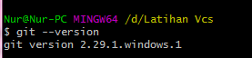

# Latihan-Vcs

**Nama :faizaldwianto**  
**Kelas :TI.20.A.1**  
**NIM :312010467**  

# Langkah-Langkah Penggunaan Git
* Download git terlebih dahulu,dengan link berikut :[click Here](https://git-scm.com/download/win)

  
